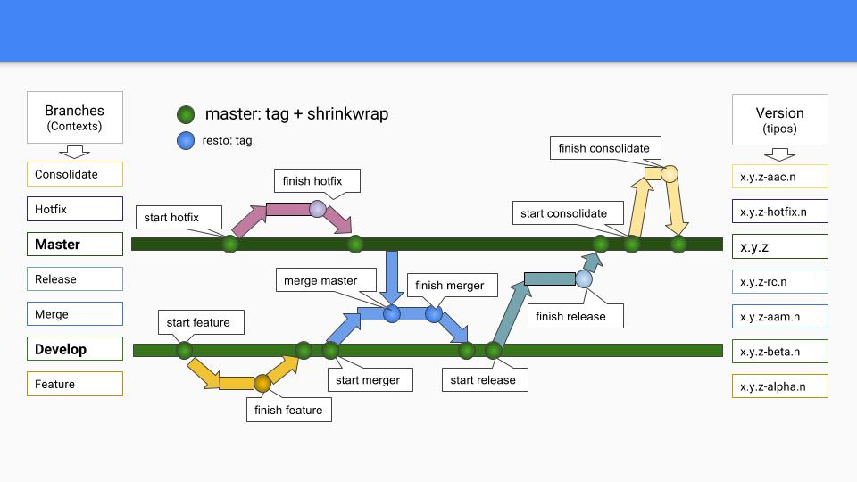

# What is **Gluon**?

Taking GitFlow model (http://nvie.com/posts/a-successful-git-branching-model/) for branch based release management. We have developed a release management methodology of code source, artifact generation and automate versioning. (LINK TO METHODOLOGY DOCUMENT)

These are the fundamentals principles of this methodology:

 - **Direct push to master and develop are forbidden**
 - **Unify versions and tags:** Code source version (bower.json, package.json, \*.gradle, pom.xml ...), artifacts version and the tags has to be **consistent and unique**

A set of piscosour recipes have been developed in order to automate many of the tasks involved in **Gluon** methodology

These tasks are:

 - **init**: Converts any repository to a repository prepared for **Gluon**
 - **start**: Creates a new branch within **Gluon**.
 - **finish**: Finish a **Gluon** branch
 - **merge**: Merge **master** changes into **develop**.

 